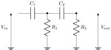
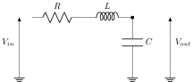
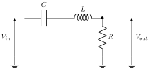
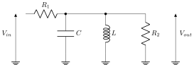
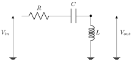
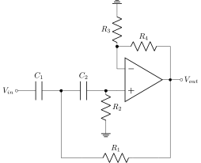
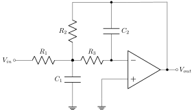
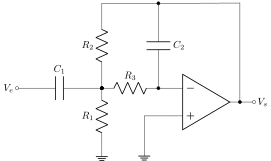
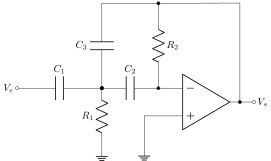
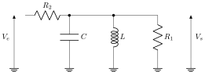

Travail Collaboratif : Analog Filter
====================================

Description du travail 
----------------------

Objectifs
+++++++++

Dans ce travail, nous souhaitons développer des fonctions Python pour analyser des circuits d'ordre 2. 
Pour chaque filtre d'ordre 2, nous souhaitons traiter les problèmes suivants :

1. Calcul de la fonction de transfert, puis écriture sous forme normalisée, 
2. Implémentation d'une fonction :code:`lti` permettant d'obtenir la fonction de transfert en Python à partir des composants, 
3. Implémentation d'une fonction :code:`get_params` permettant d'obtenir les paramètres de la fonction de transfert, 
4. Implémentation d'une fonction :code:`get_components` permettant d'obtenir les composants du filtre à partir des paramètres.
5. Validation sur LTSpice

Fonctions de transfert normalisées 
```````````````````````````````````

* Passe-bas (LP)

.. math::

    H(p)=\frac{T_0}{\frac{1}{\omega_0^2}p^2+\frac{2m}{\omega_0}p+1}​

* Passe-bande (BP)

.. math::

    H(p)=\frac{\frac{2mT_m}{\omega_0}p}{\frac{1}{\omega_0^2}p^2+\frac{2m}{\omega_0}p+1}​

* Passe-haut (HP)

.. math::

    H(p)=\frac{\frac{T_{\infty}}{\omega_0^2}p^2}{\frac{1}{\omega_0^2}p^2+\frac{2m}{\omega_0}p+1}​


Liste des circuits 
------------------


.. note ::
    
    Chaque étudiant devra choisir un filtre passif et un filtre actif.

Circuits RC/RC
++++++++++++++


  RC/RC LP Filter


  RC/RC BP Filter



  RC/RC HP Filter

Circuits RLC
++++++++++++



  RLC LP Filter



  RLC BP1 Filter



  RLC BP2 Filter



  RLC HP Filter

Circuits Sallen Key
+++++++++++++++++++

.. figure:: ../courses/img/SK_LP.svg
  :width: 300
  :align: center
  :alt: SK LP

  SK LP Filter



  SK HP Filter

Circuits MFB
++++++++++++



  MFB LP Filter



  MFB BP Filter

.. figure:: ../courses/img/MFB_BP2.svg
  :width: 300
  :align: center
  :alt: MFB BP2

  MFB BP2 Filter



  MFB HP Filter


Exemple 
-------

Dans cet exemple, nous allons considérer l'analyse complète du circuit suivant :



        RLC_BP3 Filter

 
Fonction de transfert
+++++++++++++++++++++

En utilisant le pont diviseur de tension, nous obtenons

.. math ::

    V_s(p) = \frac{Z_{eq}}{R_2+Z_{eq}}V_e(p) \Rightarrow \frac{V_s(p)}{V_e(p)} = \frac{1}{1+\frac{R_2}{Z_{eq}}}

où

.. math ::

    \frac{1}{Z_{eq}} = \frac{1}{Z_L}+\frac{1}{Z_{R_1}}+\frac{1}{Z_c}=\frac{1}{Lp}+\frac{1}{R_1}+Cp


Il en vient que :

.. math ::

    H(p)= \frac{\frac{L}{R_2}p}{1+L(\frac{R_1+R_2}{R_1R_2})p+LCp^2}

Implémentation
++++++++++++++

Fonction `lti_RLC_BP3`
``````````````````````

Pour implémenter la fonction de transfert, nous pouvons utiliser la fonction `lti` du module `scipy`.

.. code ::

    import numpy as np 
    from scipy.signal import lti


    def lti_rlc_bp3(L, C, R1, R2):
        """
        Create the transfer function for the RLC_BP3 filter.

        Parameters
        ----------
        L : float
        C : float 
        R1 : float 
        R2 : float

        Returns
        -------
        system : an instance of the LTI class 
        """

        num = [L/R2,0]
        den = [L*C, L*(R1+R2)/(R1*R2), 1]
        return lti(num, den)    
        

Fonction `get_params`
`````````````````````

En identifiant la fonction de transfert avec la fonction de transfert normalisée d'un passe-bande, nous obtenons :

.. math::

    H(p)=\frac{\frac{2mT_m}{\omega_0}p}{\frac{1}{\omega_0^2}p^2+\frac{2m}{\omega_0}p+1}​

avec 

.. math ::

    w_0 &= \frac{1}{\sqrt{LC}}\\
    m &= \frac{1}{2}\left(\frac{R_1+R_2}{R_1R_2}\right)\sqrt{\frac{L}{C}}\\
    T_{m} &= \frac {R_1} {R_1 + R_2} 


.. code ::

    def get_params(L, C, R1, R2):
        """
        Compute the maximum gain, the angular frequency and the damping factor of the RLC_BP3 filter.

        Parameters
        ----------
        L : float
        C : float 
        R1 : float 
        R2 : float

        Returns
        -------
        Type: string 
        Tm : float 
        w0 : float 
        m : float
        """

        Tm = R1 / (R1+R2)
        w0 = 1/ np.sqrt(L*C)
        m = 0.5*((R1+R2)/(R1*R2))*np.sqrt(L/C)
        return "BP", Tm, w0, m

Fonction `get_components`
`````````````````````````

Comme nous avons 3 équations et 4 composants, nous devons fixer un composant.
En fixant la bobine L, nous obtenons alors les équations suivantes : 

.. math ::
    C &=\frac{1}{L \omega_0^2}\\
    R_2 &=\frac{1}{2 m T_{m}}\sqrt{\frac{L}{C}}\\
    R_1 &= \frac{R_2 T_{m}}{1 - T_{m}}\\

.. code ::
        
    def get_components(Tm, w0, m, L):
        """
        Returns the circuit components from the filter parameters.

        Parameters
        ----------
        Tm : float 
        w0 : float 
        m : float
        L : float

        Returns
        -------
        C : float 
        R1 : float 
        R2 : float
        """

        C = 1 / (L*(w0**2)) 
        R2 = (1/(2*m*Tm))*np.sqrt(L/C)
        R1 = (R2*Tm) / (1-Tm)
        return C, R1, R2


Approche Objet
++++++++++++++

Au lieu de définir des fonctions, il est d'adopter une approche objet afin de gagner en organisation, clarté et modularité. Il est également
possible d'implémenter des tests unitaires pour vérifier le bon comportement de notre classe. 

Classe `RLC_BP3_Filter`
```````````````````````

Pour implémenter notre classe, nous allons créer le fichier `filter_RLC.py` contenant le code suivant.

.. literalinclude:: ./code/filter_RLC.py
   :language: python
   :linenos:


Test unitaire
`````````````

Pour valider le bon fonctionnement de la classe, il est possible de réaliser un test unitaire. Un test unitaire est une méthode de test de logiciel où des unités individuelles (ou composants) d'un logiciel sont testées séparément pour s'assurer qu'elles fonctionnent correctement. L'objectif est d'isoler chaque partie du programme et de vérifier qu'elle fonctionne comme prévu.

En python, les tests unitaires peuvent être réalisés facilement avec le framework `unitests`. Dans notre cas, nous allons créer le fichier `test_filter_RLC.py` contenant le code suivant. 

.. literalinclude:: ./code/test_filter_RLC.py
   :language: python
   :linenos:

Pour tester le bon fonctionnement de la classe `RLC_BP3_Filter`, il suffit ensuite de lancer le script python suivant

.. code ::

    python test_filter_RLC.py

