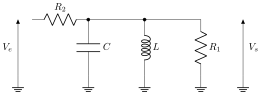

Travail Collaboratif : Analog Filter
====================================

Dans ce tutorial, nous allons réaliser une analyse complète du circuit suivant :

        RLC_BP3 Filter

Spécifiquement, nous allons traiter les problèmes suivants :

1. Calcul de la fonction de transfert ,
2. Implémentation d'une fonction :code:`lti_rlc_bp3` permettant d'obtenir la fonction de transfert en Python à partir des composants, 
3. Implémentation d'une fonction :code:`get_params` permettant d'obtenir les paramètres de la fonction de transfert, 
4. Implémentation d'une fonction :code:`set_components` permettant d'obtenir les composants du filtre à partir des paramètres.

Fonction de transfert
---------------------

En utilisant le pont diviseur de tension, nous obtenons

.. math ::

    V_s(p) = \frac{Z_{eq}}{R_2+Z_{eq}}V_e(p) \Rightarrow \frac{V_s(p)}{V_e(p)} = \frac{1}{1+\frac{R_2}{Z_{eq}}}

où

.. math ::

    \frac{1}{Z_{eq}} = \frac{1}{Z_L}+\frac{1}{Z_{R_1}}+\frac{1}{Z_c}=\frac{1}{Lp}+\frac{1}{R_1}+Cp

Il en vient que :

.. math ::

    H(p)= \frac{\frac{L}{R_2}p}{1+L(\frac{R_1+R_2}{R_1R_2})p+LCp^2}

Implémentation
--------------

Fonction `lti_RLC_BP3`
+++++++++++++++++++++

Pour implémenter la fonction de transfert, nous pouvons utiliser la fonction `lti` du module `scipy`.

.. code ::

    import numpy as np 
    from scipy.signal import lti

    def lti_rlc_bp3(L, C, R1, R2):
        """
        Create the transfer function for the RLC_BP3 filter.

        Parameters
        ----------
        L : float
        C : float 
        R1 : float 
        R2 : float

        Returns
        -------
        system : an instance of the LTI class 
        """

        num = [L/R2,0]
        den = [L*C, L*(R1+R2)/(R1*R2), 1]
        return lti(num, den)    
        

Fonction `get_params`
+++++++++++++++++++++

En identifiant la fonction de transfert avec la fonction de transfert normalisée d'un passe-bande, nous obtenons :

.. math::

    H(p)=\frac{\frac{2mT_m}{\omega_0}p}{\frac{1}{\omega_0^2}p^2+\frac{2m}{\omega_0}p+1}​

avec 

.. math ::

    w_0 &= \frac{1}{\sqrt{LC}}\\
    m &= \frac{1}{2}\left(\frac{R_1+R_2}{R_1R_2}\right)\sqrt{\frac{L}{C}}\\
    T_{m} &= \frac {R_1} {R_1 + R_2} 

.. code ::

    def get_params(L, C, R1, R2):
        """
        Compute the maximum gain, the angular frequency and the damping factor of the RLC_BP3 filter.

        Parameters
        ----------
        L : float
        C : float 
        R1 : float 
        R2 : float

        Returns
        -------
        Tm : float 
        w0 : float 
        m : float
        """

        Tm = R1 / (R1+R2)
        w0 = 1/ np.sqrt(L*C)
        m = 0.5*((R1+R2)/(R1*R2))*np.sqrt(L/C)
        return Tm, w0, m

Fonction `set_components`
+++++++++++++++++++++++++

Comme nous avons 3 équations et 4 composants, nous devons fixer un composant.
En fixant la bobine L, nous obtenons alors les équations suivantes : 

.. math ::
    C &=\frac{1}{L \omega_0^2}\\
    R_2 &=\frac{1}{2 m T_{m}}\sqrt{\frac{L}{C}}\\
    R_1 &= \frac{R_2 T_{m}}{1 - T_{m}}\\

.. code ::
        
    def set_components(Tm, w0, m, L):
        """
        Set the circuit components from the filter parameters.

        Parameters
        ----------
        Tm : float 
        w0 : float 
        m : float
        L : float

        Returns
        -------
        C : float 
        R1 : float 
        R2 : float
        """

        C = 1 / (L*(w0**2)) 
        R2 = (1/(2*m*Tm))*np.sqrt(L/C)
        R1 = (R2*Tm) / (1-Tm)
        return C, R1, R2
